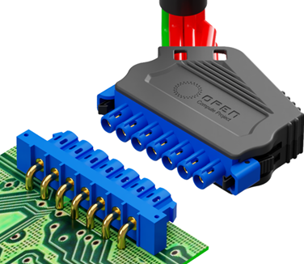
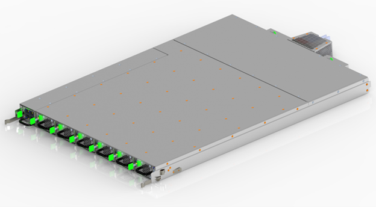
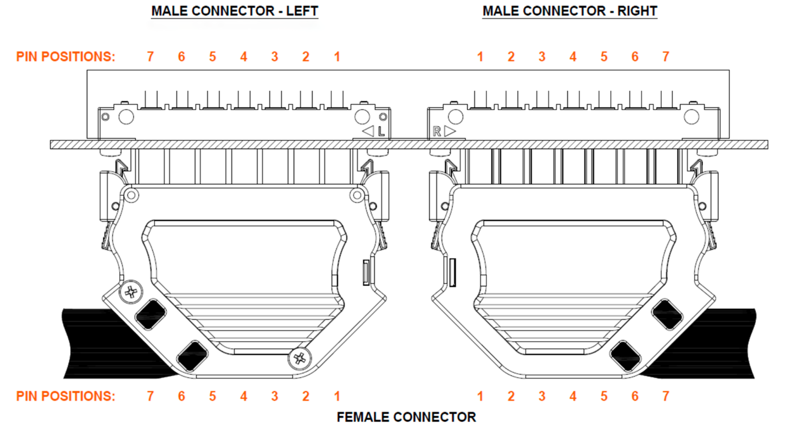
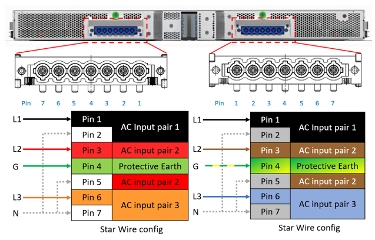

So what is ORV3?  

**ORV3** is the future of power delivery for high-performance computing and data center infrastructure. The future is available at StayOnline, The Power Cord Company.

**ORV3** stands for **Open Rack Version 3**, which is a specification developed by the [Open Compute Project](https://www.opencompute.org/) (OCP) for next-generation data center racks and power infrastructure. ORV3 is designed to address the increasing power, cooling, and scalability demands of high-performance computing (HPC), artificial intelligence (AI), and cloud data centers.

<iframe width="560" height="315" src="https://www.youtube.com/embed/Riu0KA5Eofw?si=Eju5qQM60wc73ZA1" title="YouTube video player" frameborder="0" allow="accelerometer; autoplay; clipboard-write; encrypted-media; gyroscope; picture-in-picture; web-share" referrerpolicy="strict-origin-when-cross-origin" allowfullscreen></iframe>

StayOnline [ORV3 Power Cords](https://www.stayonline.com/orv3/) are compatible with all power shelf manufacturers and can handle AC or DC power. Common male plug options include L6-30, California Standard 8365, and IEC 60309 532P6.

The ORV3 Connector features a unique 7-pin design for use in HPC environments.

The HPC ORV3 power shelf distributes power up or down the rack along a busbar. 

See below for schematics and wiring diagrams.

## Why order ORV3 cords from StayOnline?

- StayOnline engineers are here to help you with custom lengths, designs and configurations
- All StayOnline ORV3 cords are made to order in our ISO9001:2015 factory in Henderson, North Carolina with no minimum order quantity and quick delivery
